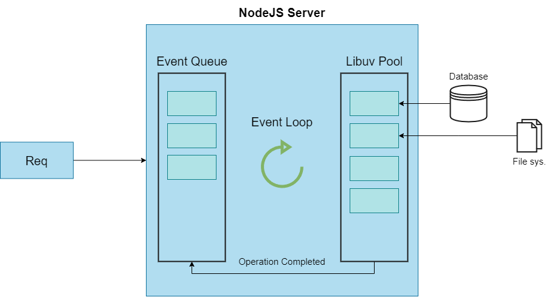

# NodeJS Basics

This project covers NodeJS basics, such as:

- Creating a Node Server
- Node Lifecycle & Event Loop
- Understanding Requests
- Sending Responses
- Request & Response Headers
- Routing Requests
- Redirecting Requests
- Parsing Request Bodies
- Understanding Event Driven Code Execution
- Blocking and Non-Blocking Code
- Node Module System

## Creating a Node Server

To spin up a server using Node you need to import some of the Node's core functionality.

Node Core Modules:

- _http_ module is designed with http interface to support many of the protocols features.
- _https_ module is designed for http protocol over TLS/SSL.
- _fs_ module enables us to interact with the file system. In a way it is modeled on standard POSIX functions.
- _path_ module provides utilities for working with file and directory paths.
- os module provides utilities such as methods and properties used for interacting with the operating system.

When importing modules it is important to take a note of the path format used for the module import. In case you are using relative path the `require("./http")` the require method will look for module within the relative path. However, if you use just the module name, then it will look at the global scope and try to find the NodeJS module there.

```JavaScript
// NodeJS Imports
const http = require("http");

// func. for event listener
// Simply a function that will execute for every
// incoming request. It will print the the req to the stdout medium,
// in case of running it from the terminal emulator it will default to it.
function reqListener(req, res) {
console.log(req);
}

// Takes event listener func as an arg.
const server = http.createServer(reqListener);

// Listen to port 3000 at your localhost address for incoming req
server.listen("3000", "localhost");
```

## NodeJS Program Lifecycle

Note: A process is an active entity as opposed to a program, which is considered to be a passive entity. A new process is created only when running an executable file.

**Preamble:**
NodeJS is JavaScript runtime that is built on top of Chrome's V8 engine. It uses an event-driven, non-blocking I/O model that makes it most scalable and popular framework.
Non-blocking means that multiple requests can be processed in parallel.

**The Event loop:**
Event loop makes tasks very fast and is also able to perform multitasking. Event loop is what allows NodeJS to perform non-blocking I/O operations. NodeJS is single-threaded event-driven platform that is capable of running non-blocking, asynchronous programs. It does this by assigning operations to the operating system whenever and wherever possible.

Now, most operating systems are multi-threaded hence can handle multiple operations executing in the background. When one process is completed the kernel tells Node.js this and the respective callback assigned to that operation is added to the event queue which will eventually be executed.

_Event loop features_ are:

- Event loop is an endless loop, which waits to receive tasks, it then executes them and then sleeps until it receives more tasks.
- The event loop executes tasks from the event queue only when the call stack is empty i.e there is no ongoing task.
- The event loop allows us to use callbacks and promisees.
- The event loop executes the tasks starting from the oldest first.

**How Event Loop Works?**

When NodeJS starts it initializes the event loop, processes the provided script which may make async API calls, schedule timers, then begins processing the event loop.

In Node.js _libuv_ module is used to perform async operations. This module/lib. is also used by the back logic of NodeJS to manage a special thread pool called _libuv thread pool_. This thread pool is comprised of four threads to which operations that are too heavy for the event loop are delegated. Example of such heavy processes are: opening and closing connections, setting timeouts...

The libuv thread pool completes tasks which triggers callback function that handles errors or other operations depending on the process that was executed by the thread. This callback function is sent to the event queue. When the call stack is empty, the event goes through the event queue and sends the callback to the call stack.



## Requests & Responses in NodeJS

Accessing the contents of the req. received by the nodejs server is easy. If you have have created the basic http server setup, the req. and res. objects will be provided to the callback function.

When it comes to constructing the response package, nodejs server provides the callback func. with the second argument object which includes all the necessary methods to do so.

```JavaScript

const server = http.createServer((req, res) => {
    // Logs the req received
    console.log(req.url, req.method, req.headers);

    // Constructs the resp package that is going to be sent
    // over the http protocol
    res.setHeader("Content-Type", "text/html");
    res.write("<html>");
    res.write("<head><title>My First Page</title></head>");
    res.write("<body><h1>My First Page</h1></body>");
    res.write("</html>");
    res.end();
});
```

Note: The above code is the most basic setup that you could use to run a server. For production grade applications you are not going to use this approach. This approach is more to show the very basics of NodeJS. Good example would be the Express.js framework.
